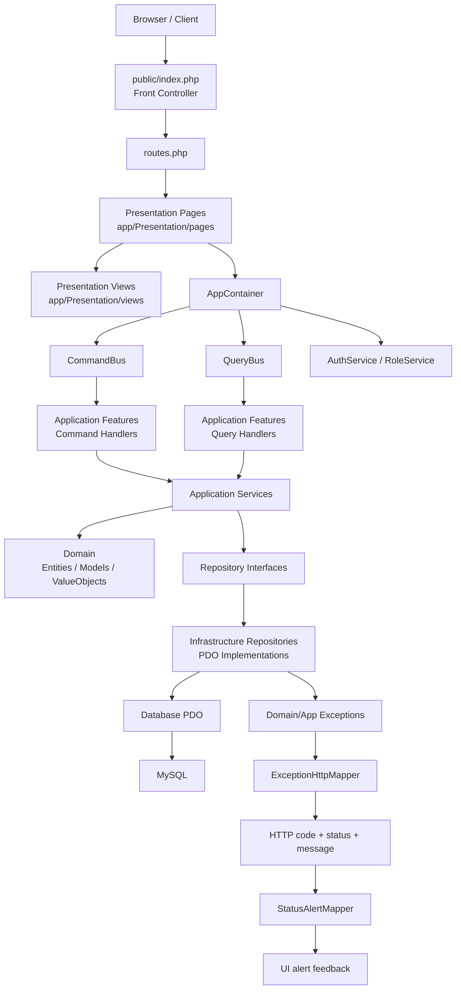

# JobVault

Job vacancy and user management system built with PHP + MySQL, featuring authentication, permissions, and a web UI.

## Overview
This project provides:
- Vacancy CRUD
- User CRUD
- Permission-based access control
- Authentication and sessions
- Activity logging
- Command and query buses with behavior pipeline (validation, authorization, transaction, logging)
- Centralized exception-to-HTTP/status mapping for UI feedback

## Structure and architecture
Layered organization (Clean Architecture-inspired):
- `app/Domain`: models and contracts
- `app/Application`: business services (Auth, Vacancies, Users, Roles)
- `app/Application/Exceptions`: application-level exceptions (forbidden, not found, validation, etc.)
- `app/Infrastructure`: persistence and container
- `app/Db/Exceptions`: database infrastructure exceptions
- `app/Presentation`:
  - `pages/` (route controllers)
  - `views/` (layouts and pages)
  - `Support/ExceptionHttpMapper.php` and `Support/StatusAlertMapper.php` for front-facing error messages
- `public/index.php`: front controller (routes via `?r=`)

## Architecture diagram


## Methodologies and patterns
- Layered separation (Domain / Application / Infrastructure / Presentation)
- Services for business rules
- Repositories for data access
- Simple view renderer for templates
- Exception-driven error flow with centralized HTTP/status mapping

## Main routes
- `index.php?r=home` (vacancies)
- `index.php?r=vacancies`
- `index.php?r=vacancies/new`
- `index.php?r=vacancies/edit&id=<uuid>`
- `index.php?r=vacancies/delete&id=<uuid>`
- `index.php?r=vacancies/apply`
- `index.php?r=users`
- `index.php?r=users/new`
- `index.php?r=users/edit&id=<uuid>`
- `index.php?r=users/delete&id=<uuid>`
- `index.php?r=login`
- `index.php?r=logout`

## Error handling and front feedback
Application and infrastructure errors are mapped to a normalized payload:
- `httpCode` (HTTP response code)
- `status` (URL-friendly status used by the UI)
- `message` (user-facing message)

Core mapper:
- `app/Presentation/Support/ExceptionHttpMapper.php`

Alert dictionary:
- `app/Presentation/Support/StatusAlertMapper.php`

Common statuses:
- `success`
- `error`
- `exists`
- `not_found`
- `validation_error`
- `forbidden`
- `unauthorized`
- `db_error`
- `server_error`

Pages redirect with:
- `?status=<status>&message=<urlencoded-message>`

Database layer throws dedicated exceptions:
- `DatabaseConnectionException`
- `DatabaseQueryException`

## Run with Docker
```bash
cp .env.example .env
docker compose build
docker compose up -d
```

Open: `http://localhost:8080/index.php?r=home`

> The database is initialized from `setup.sql` on first start.

## Tests
- Unit: `./vendor/bin/phpunit --testsuite Unit`
- Integration: `RUN_INTEGRATION=1 ./vendor/bin/phpunit --testsuite Integration`
- HTTP regression example: `./vendor/bin/phpunit tests/Integration/Presentation/UsersAdminHttpRegressionTest.php`
- Mapper unit test example: `./vendor/bin/phpunit tests/Unit/Presentation/ExceptionHttpMapperTest.php`

Install test dependencies:
```bash
docker compose exec php composer install
```

If PHP is not available locally, run tests with Docker:
```bash
docker run --rm -v "$PWD":/app -w /app php:8.3-cli ./vendor/bin/phpunit --testsuite Unit
```
