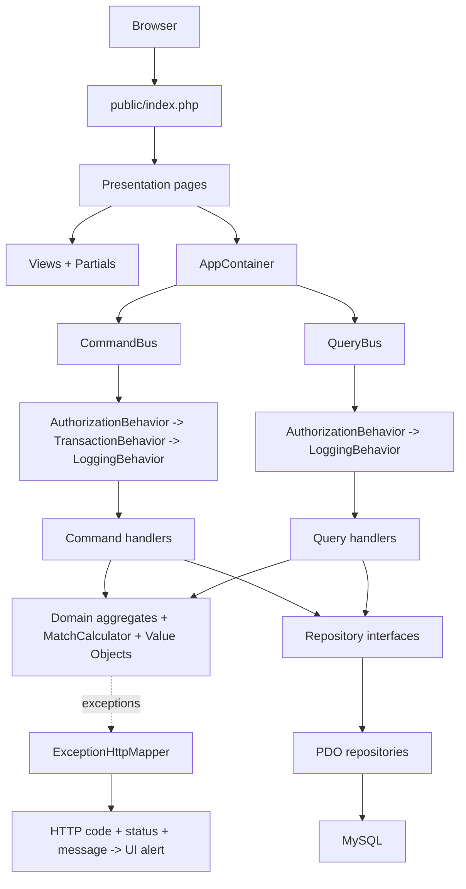

# JobVault

Job vacancy, company, and talent matching system built with PHP + MySQL, featuring authentication, role/permission-based access control, candidate profiles, company-scoped recruitment, and a two-sided compatibility engine.

## Overview
This project provides:
- **Vacancy CRUD & Topic Tagging** — vacancies include work area, seniority, work mode, normalized topic/skill tags, and belong to a company
- **Companies & Multi-Recruiter Accounts (`1:N`)** — self-registration as Candidate or Company, company profile management, and company-level isolation so recruiters manage only their own company's vacancies (while admins manage all)
- **Candidate Profiles** — professional headline, bio, primary work area, seniority level, preferred work mode, social/portfolio links (LinkedIn, GitHub), and interactive topic/skill tags
- **Two-Sided Compatibility Matching (`MatchCalculator`)**:
  - **Candidate side:** open vacancies show a `0–100%` match score, highlight matched topic tags in green, and can be filtered/sorted by best match
  - **Company / Admin side:** applicants per vacancy are ranked from highest to lowest `% match`, showing their bio, matched vs. missing topics, and direct contact/profile links
- **User, Role & Permission Administration** — tabbed admin workspace for users, companies, roles, and permissions
- **Command & Query Buses** with a behavior pipeline (authorization, transaction, logging)
- **Centralized Exception-to-HTTP/Status Mapping** for consistent UI feedback
- **Responsive Dark-Mode App Shell** — sidebar layout, mobile offcanvas navigation, stacked mobile tables, and external CSS/JS assets (`public/assets/css/app.css`, `public/assets/js/app.js`)

## Structure and architecture
Layered (Clean Architecture / DDD-inspired). Dependencies only point inwards:
`Presentation -> Application -> Domain` and `Infrastructure -> Application/Domain`.

- `app/Domain` - pure PHP, no framework/SQL/HTTP:
  - `Vacancy/` - `Vacancy` (publish, revise, open/close, company ownership, topics, `receiveApplicationFrom()`), `VacancyStatus`, `VacancyTitle`, `VacancyDescription`, `VacancyFilter`
  - `Company/` - `Company` (corporate identity, sector, website, description), `CompanyId`, `CompanyName`, `CompanyRepositoryInterface`
  - `CandidateProfile/` - `CandidateProfile` (headline, bio, area, seniority, work mode, links, normalized topic tags), `CandidateProfileRepositoryInterface`
  - `Matching/` - `MatchCalculator` (pure domain service scoring candidate vs. vacancy compatibility `0..100%`) and `MatchResult`
  - `JobApplication/` - `JobApplication` (created only through an open vacancy), `AlreadyAppliedException`
  - `User/` - `User` (register, verifyPassword, changeProfile, changePassword, assignRole, assignCompany), `EmailAddress`, `PersonName`, `PlainPassword`, `PasswordHash`, `UserFilter`
  - `Role/` - `Role` (rename guard for admin, grant/revoke permissions, `ensureCanBeDeleted()`), `RoleName`
  - `Permission/` - `Permission`, `PermissionName` (`module.action` composition/normalization)
  - `Shared/` - typed ids (`AbstractId`), `WorkArea`, `Seniority`, `WorkMode`, `TopicTag` (slug normalization & alias deduplication), `PageRequest`, `SearchTerm`; `Exception/` - domain exceptions
  - Repository interfaces live next to their aggregate and expose intent methods (`matching(filter, page)`), never SQL.
- `app/Application` - use cases:
  - `Commands/`, `Queries/`, `Features/` (one handler per use case for `Users`, `Companies`, `Profile`, `Vacancies`, `Applications`, `Roles`, `Permissions`, `RolePermissions`)
  - `Features/Vacancies/VacancyAccessScope` - enforces company-level isolation for non-admin recruiters
  - `Security/` - `Authorization` (role -> permissions, cached per request), `MessageAuthorizer` (the single enforcement point deciding if a command/query can run), `CurrentUserProvider`
  - `Auth/AuthService` - login/logout and candidate or company self sign-up, no HTTP (`header()`/`exit` stay in Presentation)
  - `Users/UserRegistrar` - unique e-mail, default role, and company account creation policy
  - `Ports/` - `SessionInterface`, `LoggerInterface` implemented by Infrastructure
  - `DTOs/` - read models returned to the UI (`VacancyDto`, `VacancyApplicantDto`, `CandidateProfileDto`, `CompanyDto`, `UserDto`, `RoleDto`, `PermissionDto`, `PagedResult`)
- `app/Infrastructure` - `Persistence/` (PDO `Database` wrapper + repositories for users, companies, candidate profiles, vacancies, applications, roles, permissions), `Http/NativeSession`, `Logging/FileLogger`, `Container/AppContainer` (composition root)
- `app/Presentation` - `pages/` (thin controllers), `views/` (`layout/`, `pages/`, `partials/`), `Support/` (`PageAccess`, `Layout`, `Csrf`, `HttpRedirect`, `Pagination`, `ExceptionHttpMapper`, `StatusAlertMapper`)
- `public/` - `index.php` (front controller routing via `?r=`), `assets/css/app.css` (design system), `assets/js/app.js` (password toggle, topic chip picker, account-type switch, validation, confirmations)

## Architecture diagram

```mermaid
flowchart TD
    A[Browser] --> B[public/index.php]
    B --> D[Presentation pages]
    D --> E[Views + Partials]
    D --> F[AppContainer]
    F --> G[CommandBus]
    F --> H[QueryBus]
    G --> X[AuthorizationBehavior -> TransactionBehavior -> LoggingBehavior]
    H --> Y[AuthorizationBehavior -> LoggingBehavior]
    X --> J[Command handlers]
    Y --> K[Query handlers]
    J --> M[Domain aggregates + MatchCalculator + Value Objects]
    K --> M
    J --> N[Repository interfaces]
    K --> N
    N --> O[PDO repositories]
    O --> Q[MySQL]
    M -. exceptions .-> S[ExceptionHttpMapper]
    S --> U[HTTP code + status + message -> UI alert]
```

## Methodologies and patterns
- Rich domain model: business rules and compatibility scoring live in aggregates, domain services, and value objects
- CQRS-lite: commands change state, queries return DTOs/`PagedResult`
- Ports & adapters for session, logging, and persistence
- Single authorization enforcement point in the bus pipeline + company ownership scoping
- Exception-driven error flow with centralized HTTP/status mapping

## Main routes
- `index.php?r=home` / `index.php?r=vacancies` (vacancy management panel, scoped to the recruiter's company or all companies for admins)
- `index.php?r=vacancies/new` (publish vacancy with area, seniority, work mode, and topic tags)
- `index.php?r=vacancies/edit&id=<uuid>` (edit vacancy)
- `index.php?r=vacancies/delete&id=<uuid>` (delete vacancy confirmation)
- `index.php?r=vacancies/applicants&id=<uuid>` (applicants for a vacancy ranked by `% match`)
- `index.php?r=vacancies/apply` (open vacancies for candidates with `% match`, matched topic highlights, and filters)
- `index.php?r=profile` (candidate professional profile & topic tags editor)
- `index.php?r=company` (recruiter's company profile editor)
- `index.php?r=users` (admin panel with tabs: Users, Companies, Roles, Permissions)
- `index.php?r=users/new`, `index.php?r=users/edit&id=<uuid>`, `index.php?r=users/delete&id=<uuid>`
- `index.php?r=login` (sign in or sign up as Candidate or Company)
- `index.php?r=logout`

## Error handling and front feedback
Application and infrastructure errors are mapped to a normalized payload:
- `httpCode` (HTTP response code)
- `status` (URL-friendly status used by the UI)
- `message` (user-facing message)

Core mapper:
- `app/Presentation/Support/ExceptionHttpMapper.php`

Alert dictionary:
- `app/Presentation/Support/StatusAlertMapper.php`

Common statuses:
- `success`
- `error`
- `conflict`
- `not_found`
- `validation_error`
- `forbidden`
- `unauthorized`
- `db_error`
- `server_error`

Pages redirect with:
- `?status=<status>&message=<urlencoded-message>`

Database layer (`app/Infrastructure/Persistence/Exceptions`) throws dedicated exceptions:
- `DatabaseConnectionException`
- `DatabaseQueryException`

## Run with Docker
```bash
cp .env.example .env
docker compose build
docker compose up -d
```

Open: `http://localhost:8080/index.php?r=home`

> The database is initialized from `setup.sql` on first start. The container entrypoint runs
> `composer install` and creates `logs/` on every start, so the bind-mounted project always has a complete `vendor/`.

### Rebuild from scratch (remove image and containers)
```bash
docker compose down --rmi local      # stop/remove containers, network and the project image
docker compose build --no-cache      # rebuild the image ignoring the layer cache
docker compose up -d                 # create and start fresh containers
```

To also reset the database (deletes the `mysql_data` volume, so `setup.sql` runs again):
```bash
docker compose down --rmi local -v
docker compose up -d --build
```

> Without `-v` the MySQL data is kept and `setup.sql` is **not** executed again.

Check status and logs:
```bash
docker compose ps
docker compose logs -f php
```

### First admin user
`setup.sql` creates no admin. Sign up on the login page, then promote the account:
```bash
docker compose exec mysql mysql -uappuser -papp_password myapp_db -e \
  "UPDATE users SET role_id=(SELECT id FROM roles WHERE name='admin') WHERE email='you@example.com';"
```

## Tests
- Everything (inside the container): `docker compose exec php ./vendor/bin/phpunit`
- With MySQL integration tests: `docker compose exec -e RUN_INTEGRATION=1 php ./vendor/bin/phpunit`
- Unit (domain, matching, handlers, security, mapper): `./vendor/bin/phpunit --testsuite Unit`
- Integration (PDO repositories against MySQL, rolled back): `RUN_INTEGRATION=1 ./vendor/bin/phpunit --testsuite Integration`
- HTTP regression example: `./vendor/bin/phpunit tests/Integration/Presentation/UsersAdminHttpRegressionTest.php`
- Mapper unit test example: `./vendor/bin/phpunit tests/Unit/Presentation/ExceptionHttpMapperTest.php`

If PHP is not available locally, run tests with Docker:
```bash
docker run --rm -v "$PWD":/app -w /app php:8.3-cli ./vendor/bin/phpunit --testsuite Unit
```
